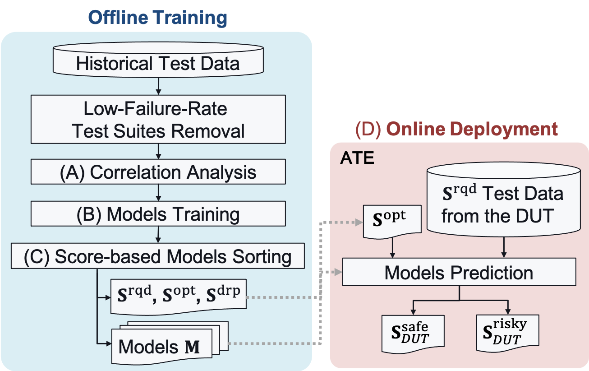

---

##### Download

+ [IEEE Link](https://ieeexplore.ieee.org/document/11022782)

---

## Abstract

As the complexity of integrated circuits advances, wafer sort faces the difficulty of balancing test time, test quality, and the preservation of diagnostic information. On the one hand, we need a high-quality wafer sort that detects defective chips at the early test stage. On the other hand, high-quality wafer sort can be time-consuming. In addition, diagnostic information from defective dies-under-test (DUTs) is crucial to improve the yield. In response, we propose a **machine learning (ML)–based adaptive wafer sort** for IC testing. By skipping some test suites, the adaptive method can save test time while retaining high quality and preserving diagnostic information. Given the competitive trade-off between test time and test quality, the adaptive wafer sort improves bin swap and failure information loss by **7.8×** and **338×** compared to the traditional test time reduction method applying a fixed set of test suites.

---

##### Figure 1: Main Flow of Adaptive Wafer Sort




---

## Citation

Y. -S. Liu, M. -H. Liu and J. C. -M. Li, "ML-based Adaptive Wafer Sort to Preserve Diagnostic Information," 2025 IEEE 43rd VLSI Test Symposium (VTS), Tempe, AZ, USA, 2025, pp. 1-7, doi: 10.1109/VTS65138.2025.11022782.

```BibTeX
@INPROCEEDINGS{11022782,
  author={Liu, Yun-Sheng and Liu, Min-Hsin and Li, James Chien-Mo},
  booktitle={2025 IEEE 43rd VLSI Test Symposium (VTS)}, 
  title={ML-based Adaptive Wafer Sort to Preserve Diagnostic Information}, 
  year={2025},
  volume={},
  number={},
  pages={1-7},
  keywords={Hands;Measurement;Adaptation models;Machine learning;Very large scale integration;Predictive models;Complexity theory;Faces;Testing;test time reduction;adaptive tests;machine learning},
  doi={10.1109/VTS65138.2025.11022782}}
```

---


