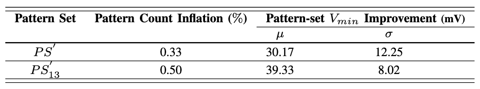
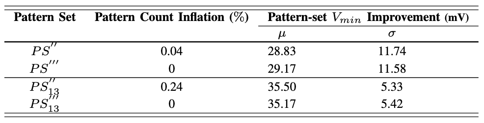

---

## Download
TBD
<!-- + [IEEE Link](??) -->

---

## Abstract

At-speed logic scan tests are an important tool to ensure desired quality in mobile chips. During initial test pattern bring-up, tests that exhibit an unexpectedly high $V_{min}$ pose a risk of over-testing and production yield loss. This is particularly problematic if the $V_{min}$ of the test is significantly higher than that of the functional system workloads. In such situations, the at-speed logic scan test is debugged to find and resolve the source of the high $V_{min}$. This paper describes an example case study of $V_{min}$ debug, in which a series of experiments are performed to identify the root cause as individual test patterns that capture the responses of unconstrained paths. We propose pre-silicon and post-silicon methods to improve $V_{min}$ by preventing problematic patterns and reducing the debug effort during test bring-up. Our methods have been verified on ATE to effectively improve $V_{min}$ by 28.83mV to 39.33mV with 0% to 0.5% pattern count inflation.

---

##### Figure 1: Results of Pre-silicon Method



##### Figure 2: Results of Post-silicon Method



---

## Citation
TBD
<!-- Prinzel, Florianus, and Moritz-Maria von Igelfeld. 2004. "The Finer Points of Sausage Dogs." *Journal of Canine Science* 43 (2): 89–109. http://www.alexandermccallsmith.com/book/the-finer-points-of-sausage-dogs. -->

<!-- ```BibTeX
@article{PI04,
author = {Florianus Prinzel and Moritz-Maria von Igelfeld},
year = {2004},
title ={The Finer Points of Sausage Dogs},
journal = {Journal of Canine Science},
volume = {43},
number = {2},
pages = {89--109},
url = {http://www.alexandermccallsmith.com/book/the-finer-points-of-sausage-dogs}}
``` -->

---

## Related Material

+ [Presentation slides](SGM_LMH_static.pdf)
