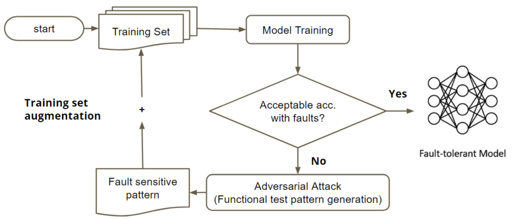
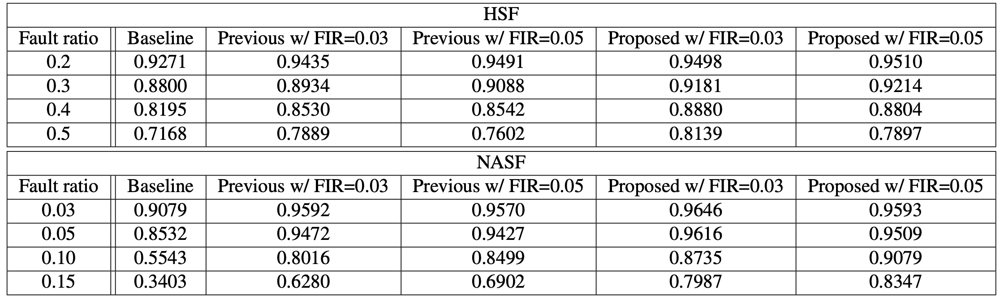
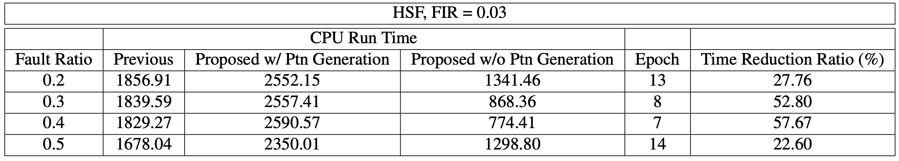
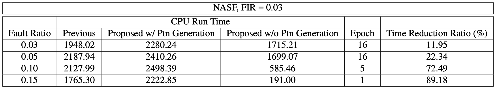

## Project Information
Project Type: Special Project

Advisor: James Chien-Mo Li

---

## Description

With the growing adoption of neuromorphic circuits in edge computing, ensuring their reliability under hardware faults has become increasingly important. While previous fault-tolerant training methods have improved robustness, they often suffer from slow convergence and limited accuracy under certain fault models. This work proposes an enhanced fault-tolerant training technique that integrates adversarial attack–based pattern generation to **accelerate convergence and improve model resilience**. By iteratively generating new training patterns that amplify discrepancies between fault-free and faulty models, the proposed method effectively increases dataset diversity and training efficiency. Experimental results on spiking neural networks (SNNs) under two neuron fault models—**HSF**(Hard to Spike Fault) and **NASF**(Neuron Always Spike Fault)—demonstrate that our approach achieves higher accuracy in faulty scenarios while maintaining comparable performance in fault-free conditions. Furthermore, the proposed method significantly reduces training time when pre-generated patterns are used, confirming the effectiveness of adversarial pattern generation for fault-tolerant model training.

---
## Method
##### Figure 1: Flow of Pattern Generation

---
## Results
### Accuracy

##### Figure 2: Average Accuracy of Each Model under Faulty Scenario

### Runtime

##### Figure 3: CPU time for HSF, FIR = 0.05

##### Figure 4: CPU time for NASF, FIR = 0.03

##### Figure 4: CPU time for NASF, FIR = 0.03

## Related Material

+ [Report](neuro_project.pdf)