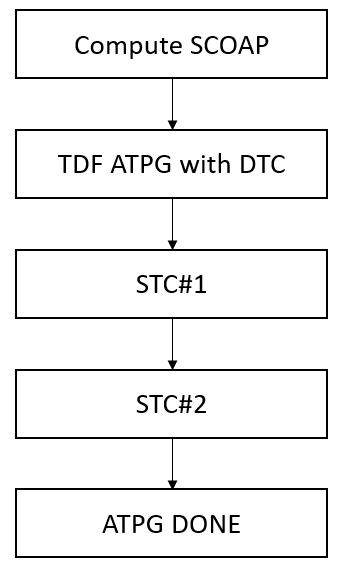
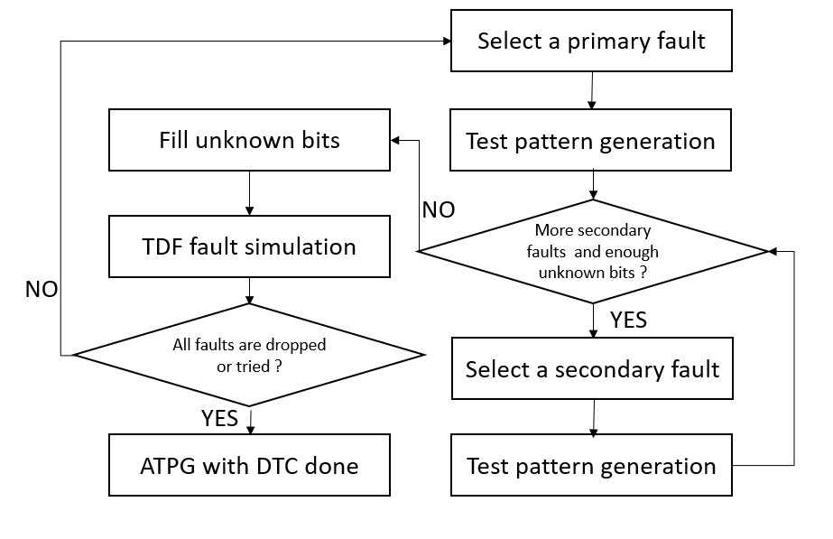
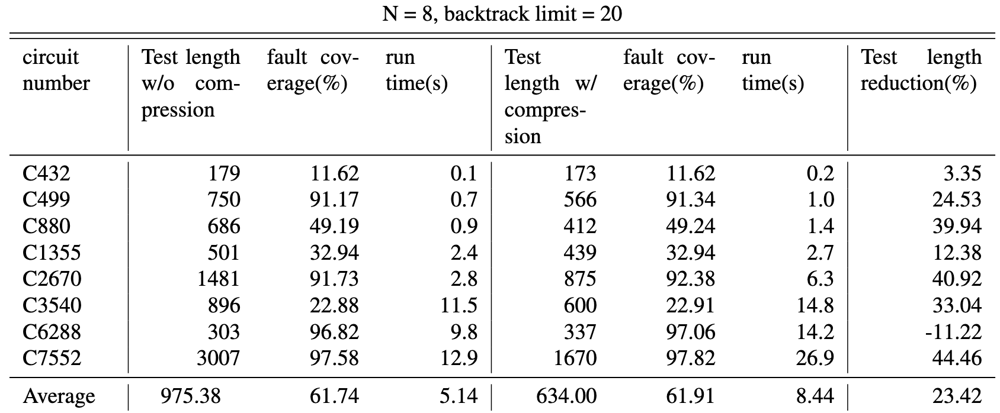

## Project Information
Project Type: Course Final Project

Course: VLSI Testing

---

## Description

This project focuses on implementing and integrating several existing methods related to transition delay fault (TDF) automatic test pattern generation (ATPG) and test compression. The goal is to build a complete flow that supports N-detect TDF ATPG based on the launch-on-shift (LOS) mode, along with both dynamic and static test compression to improve testing efficiency. In this work, I implemented a modified PODEM-based algorithm for N-detect TDF ATPG and combined it with dynamic test compression (DTC) and static test compression (STC) techniques proposed in previous studies. Experimental results on ISCAS benchmark circuits show that the combined flow can effectively reduce test length while maintaining comparable fault coverage, achieving up to 44% reduction in test length in the best case. Overall, the project successfully integrates these methods into a unified testing framework and demonstrates their effectiveness in enhancing test efficiency.

---
## Method

##### Figure 1: Overall Flow

##### Figure 2: Dynamic Test Compression(DTC)

##### Figure 3: Static Test Compression(STC)

---
## Results

##### Figure 4: Experimental Result (N = 8)

## Related Material

+ [Report](report.pdf)