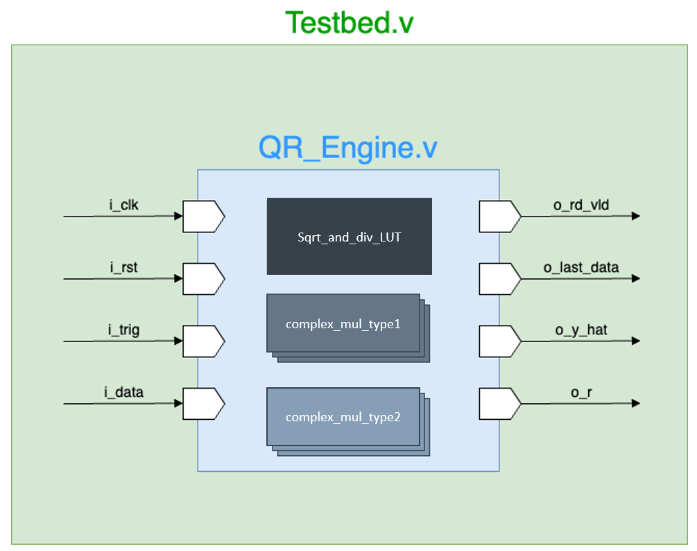
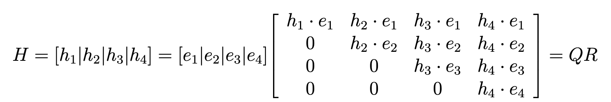
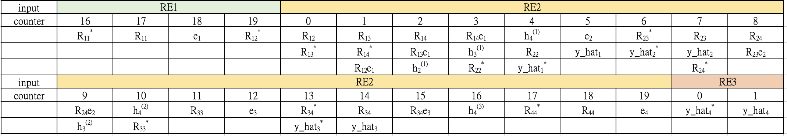

## Project Information
Project Type: Course Final Project

Course: Computer-aided Vlsi System Design

---

## Description
This project implements a hardware design for QR decomposition using the modified Gram-Schmidt algorithm, which provides faster computation and simpler implementation compared to methods such as Householder transformation and Givens rotation. The design is optimized to achieve high operating frequency and efficient resource utilization. To meet the 200 MHz frequency requirement, the architecture is carefully **pipelined** and **parallelized**, allowing multiple computations to proceed concurrently across different input rounds. The hardware includes custom modules such as lookup tables for square root and reciprocal calculations and complex multipliers with fixed-point precision. The final implementation achieves accurate results using around 2,000 registers, with well-balanced area, power, and latency performance. In the course evaluation, the design achieved a performance ranking of **9th out of 50 groups**, demonstrating both strong efficiency and practical effectiveness. Overall, this project successfully delivers a high-speed and area-efficient QR decomposition hardware design suitable for signal processing applications.

---
## Method

##### Figure 1: Hardware Block Diagram

##### Figure 2: Modified Gram-Schmidt

##### Figure 3: Hardware Scheduling

---
## Results

Each performance can be seen in the report.

---

## Related Material

+ [Report](CVSD_final.pdf)