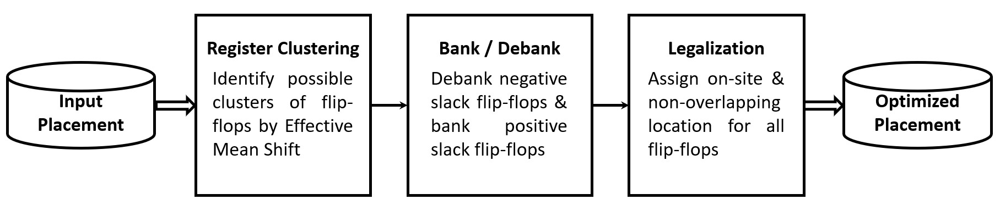
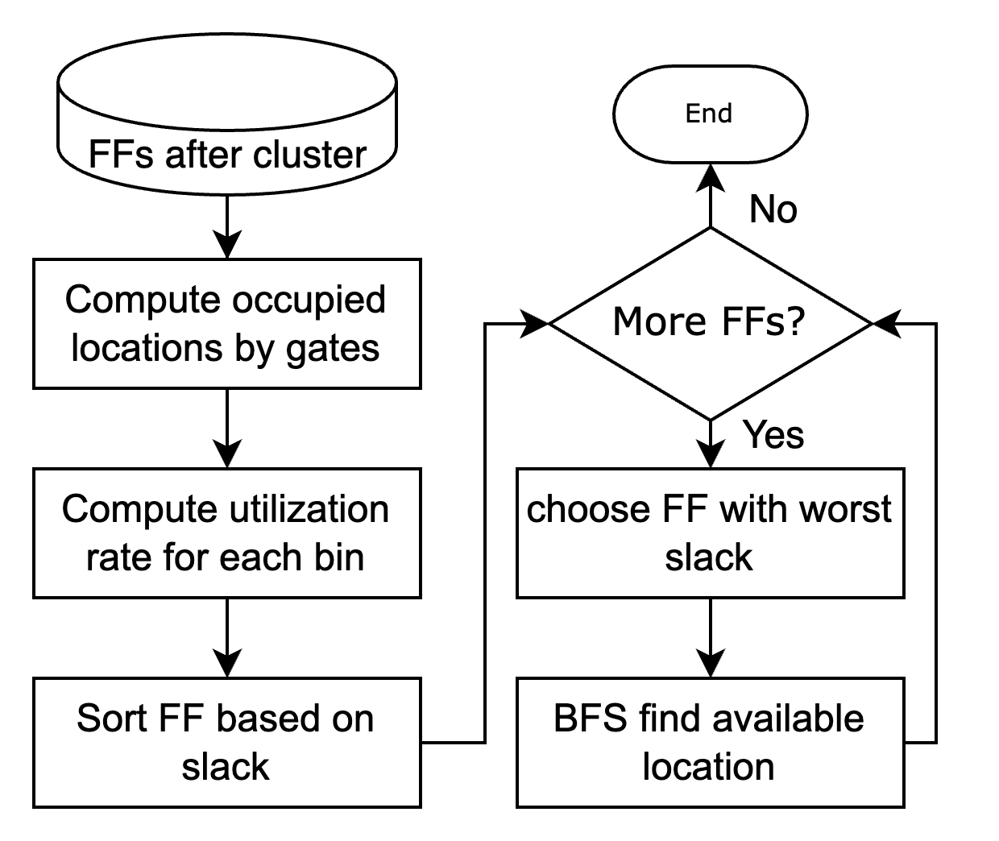
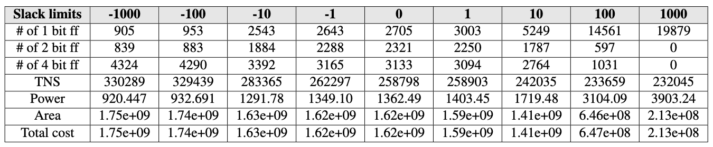
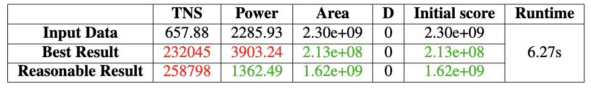

## Project Information
Project Type: Course Final Project

Course: Physical Design for Nanometer ICs

---

## Description

This project focuses on optimizing power, timing, and area in digital circuit design through the application of multibit flip-flop (MBFF) techniques. By modifying the effective mean shift algorithm, we developed a three-step flow consisting of **register clustering**, **banking and debanking**, and **legalization**. In the clustering stage, flip-flops are grouped using **K-nearest neighbor (KNN)** search and timing-aware bandwidth settings. Banking and debanking are then applied based on slack information with a multi-level merging strategy to balance timing and power. Finally, a **breadth-first search (BFS)–based** legalization ensures all flip-flops are placed legally under utilization and overlap constraints. Experimental results on ICCAD benchmark data show that our method can achieve up to **91%** cost reduction in the best case and around **30%** reduction under reasonable settings. Overall, the proposed flow effectively integrates clustering and legalization techniques to improve circuit performance while maintaining timing feasibility.

---
## Method

##### Figure 1: Overall Flow

In this project, I am mainly in charge of legalization step.

##### Figure 2: Flow of Legalization

---
## Results

##### Figure 3: Slack Limits and Corresponding Data

##### Figure 4: Final Result

## Related Material

+ [Report](PD_Final_ProblemB.pdf)